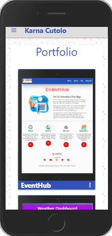

# PortfolioKC - BS Bootstrap

**Description:**

A professional site using Bootstrap following a set of specs and style guide to create a deployed Portfolio where perspective employers or clients can view my Portfolio.

Usage:
It will be the first Point of Contact where I can showcase my applications to perspective employers/clients in multiple mediums. This will demonstrate my strongest work and will lead to employment.

### File List:

1. Index.html
    
    Main Page and 'About" links

2. Portfolio.html    
    
    Portfolio link 

3. Contact.html      

    Contact link

4. Style.css         

    Stylesheet for all

5. Reset.css

    Compressed set of CSS rules that resets the styling of all HTML elements to a consistent baseline.

